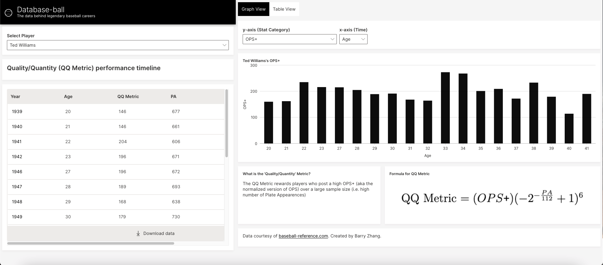
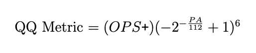
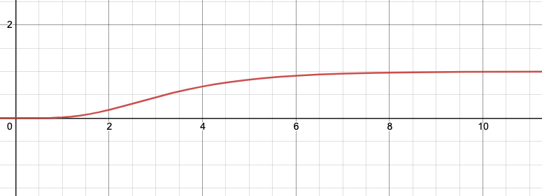

# Database-ball

 

## About <i>Database-ball</i>
Database-ball provides an interactive way of analyzing all kinds of baseball statistics, from your traditional ones like batting average, home runs, and RBIs, to more advanced ones like slugging, OPS, and OPS+, to an even cooler one I created myself: the **Quality/Quantity (QQ) Metric**.

## The <i>Quality/Quantity (QQ) Metric</i>
The QQ Metric applies an "adjustment factor" to a player's [OPS+](https://www.mlb.com/glossary/advanced-stats/on-base-plus-slugging-plus) (a normalized stat measuring offensive performance) based on how many plate appearences they had. This rewards players who provide both "Quality" and "Quantity" in abundance. Here is how it's calculated:

The graph of the adjustment factor function (the (-2^-x+1)^6) part, with the x values multiplied by 112) looks like this:

As you can see, the curve flattens out as x increases, so the adjustment factor changes less dramatically for players with a high number of plate appearences.
 
  
## About the tech
I decided to use [H2O Wave](https://wave.h2o.ai/docs/guide) to make this app because of its nice data visualization features. I also liked its functional programming model and thought it would be really fun to use.
